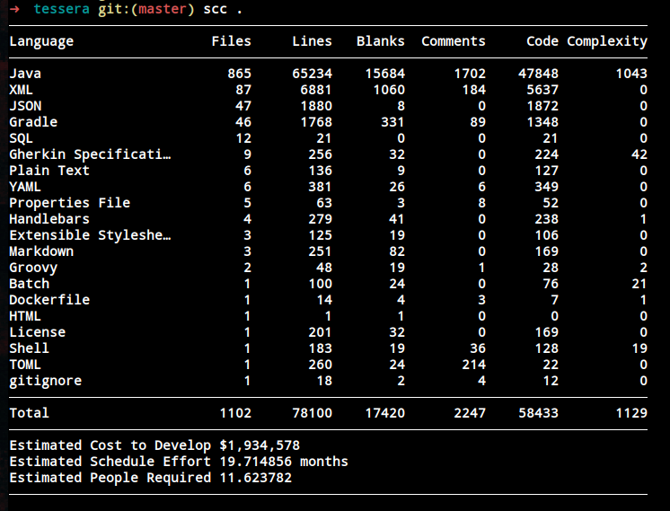
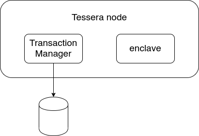
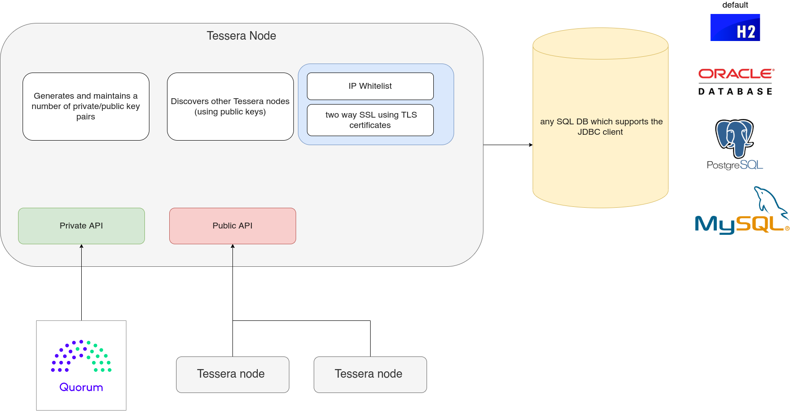
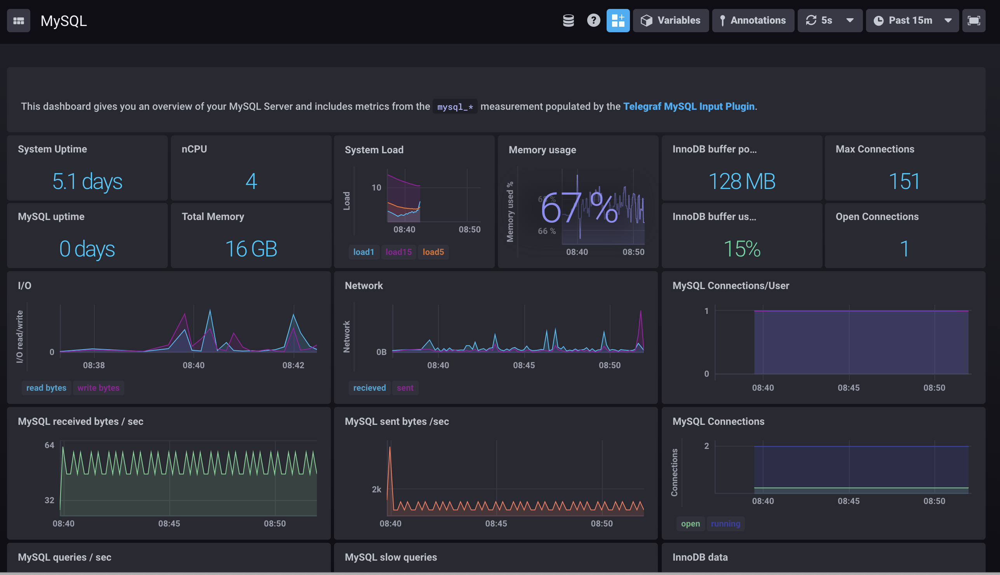
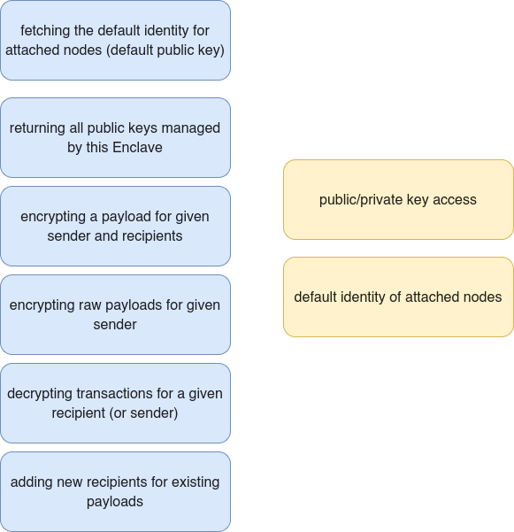
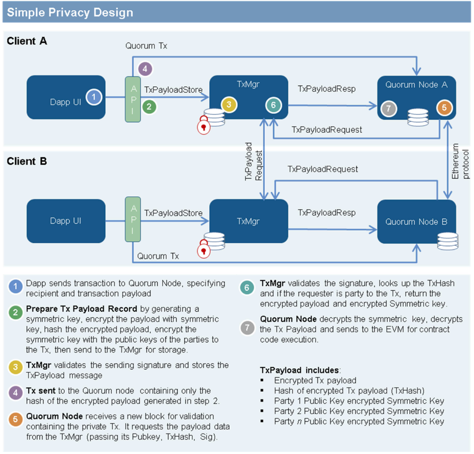

#### Tessera and Private Transactions 
## From BPMN to Permissioned blockchains: A model-driven approach

Nizar Hmain - 2020


---

# What is tessera ?

- encryption
- decryption
- distribution of private Transactions for Quorum


---

# Software cost estimation with SCC





--- 




---

- The Transaction Manager, which handles peer management and database access, as well as Quorum communication, does not contain access to any private keys and does not perform and encryption/decryption, greatly reducing the impact an attack can have.

- It connects to Quorum and interfaces with the attached enclave as well as with others transaction managers.

---

# Transaction Manager duties


- forming a P2P network of transaction managers & broadcasting peer/key information
- interfacing with the enclave for encrypting/decrypting private payloads
- storing and retrieving saved data from the database
- providing the gateway for Quorum to distribute private information


---


# Architecture of a Transaction Manager 




---

# Different types of Server

- P2P - Tessera uses this server to communicate with other Transaction Managers (the URI for this server can be shared with other nodes to be used in their peer list - see below)
- Q2T - This server is used for communications between Tessera and its corresponding Quorum node
- ENCLAVE - If using a remote enclave, this defines the connection details for the remote enclave server (see the Enclave docs for more info)
- ThirdParty - This server is used to expose certain Transaction Manager functionality to external services such as Quorum.js

---

## Configuring Influx Db for monitoring

```
"influxConfig": {
  "hostName": "[Hostname of Influx instance]",
  "port": "[Port of Influx instance]",
  "pushIntervalInSecs": "[How often to push data to InfluxDB]",
  "dbName": "[Name of InfluxDB]"
}
```

---

### Integration with InfluxDb




---

```
"peer": [
  {
    "url": "http://myhost.com:9000"
  },
  {
    "url": "http://myhost.com:9001"
  },
  {
    "url": "http://myhost.com:9002"
  }
]
```

```
"disablePeerDiscovery": true
```

Replicate the transactions to other nodes (fx audit)
```
"alwaysSendTo":["<public key 1>", "<public key 2>"]
```
---

# Tessera Enclave (Encryption/Decryption)

---

- An enclave is a secure processing environment that acts as a black box for processing commands and data.

- The Enclave is the innermost actor of the sequence of events. Each Enclave only interacts with its corresponding Transaction Manager and nothing else.


---


---

# Different Types of Enclaves

- Local Enclave : enclave sits in the same process as the transaction manager. (config of enclave and config of TM are on the same config file)

- Http Enclave aka Remote Enclave (we achieve some separation) (Start the TM with ENCLAVE server as the type)


---

# Cryptographic algorithms that are used

- 1  Curve25519 Diffie-Hellman key-exchange function: based on fast arithmetic on a strong elliptic curve
- 2 Salsa20 stream cipher: encrypts a message using the shared secret
- 3 Poly1305 message-authentication code: authenticates the encrypted message using a shared secret

Public Key authentication encryption combining these 3 algorithms.

NaCl provides a function called ``` curve25519xsalsa20poly1305 ``` which is the one used by default

---

# Tessera to Tessera API

- Node/network discovery
- Sending/Receiving encrypted payloads

```
/version
/upcheck
/push : Persist encrypted payload received from another node.
/resend
/partyinfo
/partyinfo/validate : Validates a node possesses a key

```
---
# Third Part - Public API

- Storing encrypted payloads for external apps

```
/version
/upcheck
/storeraw : Store transaction bytestring
/keys
/partyinfo/keys
```
---

# Quorum to Tessera - Private API

- Quorum uses this API to: - Check if the local Tessera node is running - Send and receive details of private transactions

```
/version
/upcheck 
/sendraw
/send
/receiveraw
/receive
/storeraw
/sendsignedtx
/transaction/{key}/isSender
/transaction/{key}/participants
```


---

# Privacy

---


```
1. S -> A -> B
2. S -> (A) -> (B)
3. S -> (A) -> [B -> C]
```

1.Public contract A calling public contract B
2. Private contract A calling Private contract B
3. Private Contract A Calling Public contract B, flips the Contract B to read-only mode contract C


```
1. (S) -> A
2. (S) -> (A)
```
If the transaction is private, the node can only execute the transaction if it has the ability to access and decrypt the payload. Nodes who are not involved in the transaction do not have the private payload at all.

---



---

# Private Contracts

- A private contract is a contract that was created by a private transaction. 
- Private state consensus is passed up to the application layer.
- When parties to a private contract require cryptographic state consensus evidence, the application can retrieve the private contract state hash for a specified block and share this value with the parties to the contract either off-chain or through an on-chain transaction.
- A specific application design may not require or expect parties to the same contract to have different state.

---

- If public state consensus is achieved, it would be impossible for parties to a private transaction to be out of consensus.


### The reasons why

- Validating a block includes a global transaction hash consensus and public state consensus and a few other checks.
- EVM is deterministic.
- Inputs are the same because we're confirming consensus on the list of txns.
- If we have the same blockchain of transactions and the public transactions result in public state consensus and since the EVM is deterministic = Impossible to have the EVM produce a different state of a private contract by processing a private transaction.


---


---

