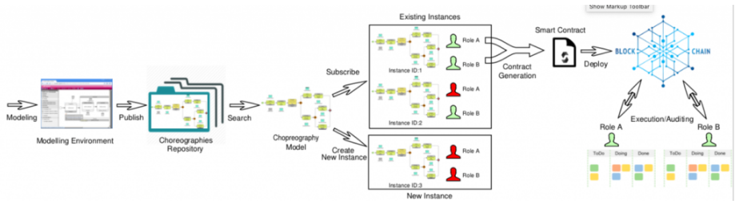
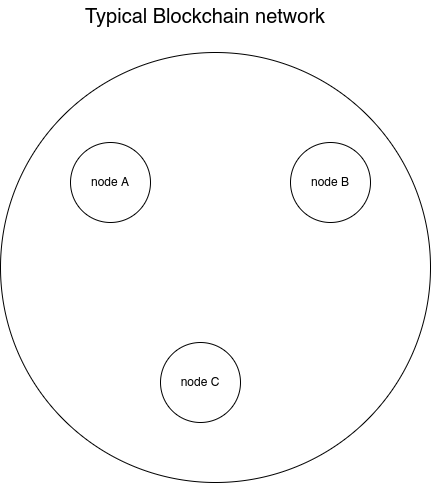
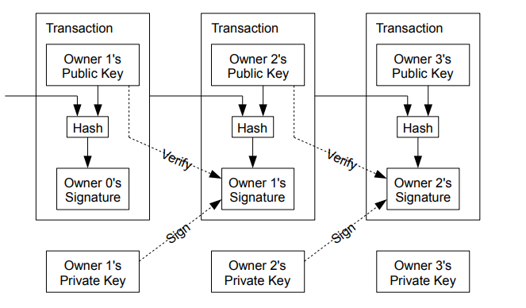
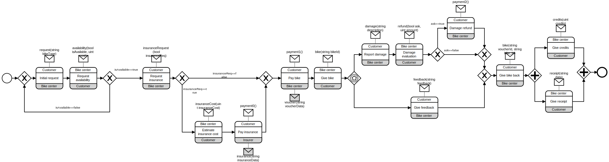
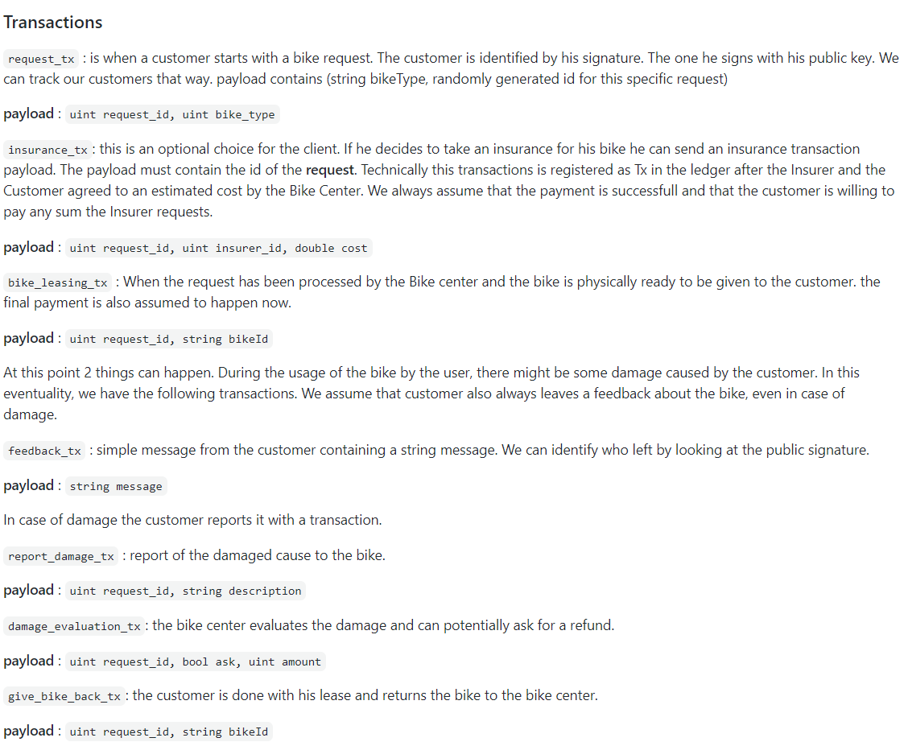
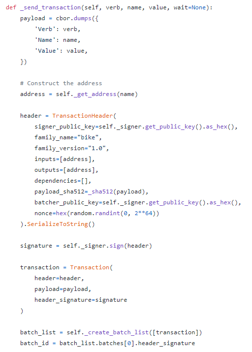
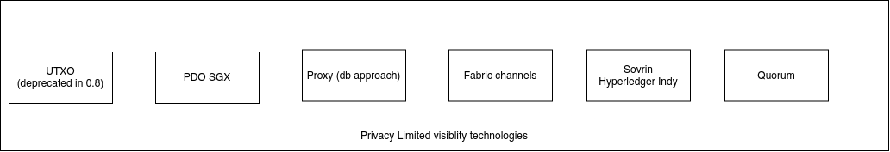
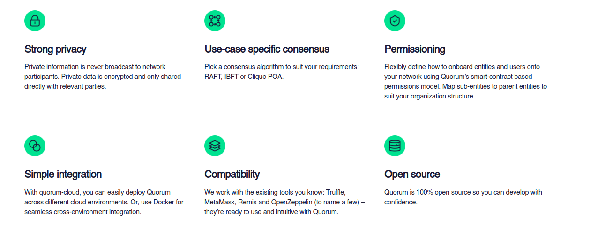
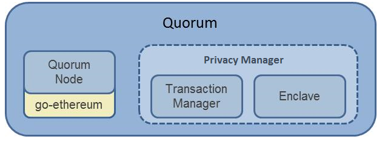

#### Intermediate Evaluation
## From BPMN to Permissioned blockchains: A model-driven approach


Nizar Hmain - 2020


---

# Intermediate evaluation

- The problem 3 mins
- Fundamentals of blockchain 2 mins 
- Potentials solutions 3 mins
- related papers 4 mins


Total time : 13 minutes

---

# The problem

ChorChain is a model-driven framework based on Blockchain technology. It supports the whole life-cycle of BPMN Choreographies from their modelling to their distributed execution.




---




---

# Fundamentals of blockchains

- The data structure

- It's Decentralized/Distributed nature

- The consensus


---



--- 

How do we prevent anyone from copying someones signature. We do so by generating a Private key / public Key pair.


---


--- 

# hyperledger sawtooth


- Try to spin up a network on 
- Understand the architecture
- Things that aren't suited for our usecase
- Front-end visualization tool

---


---

screenshot of Sawtooth-delve


--- 

# How can we integrate BPMN used here ?


--- 



---



---



--- 

So far so good, we managed to map BPMN logic into code that runs in a distributed fashion on a blockchain.

The next issue is the following. 
- How can this be automated ?
- And How can we limit the visibility of certain actions

---

- There was an attempted at writing a BPMN parser that would later transform that into python code that would be running as a Transaction processor  

- The only problem was that it isn't easy to write a BPMN parser from scratch
- Why not use some already existing work from Chorchain. (It's already capable of transforming BPMN into Solidity smart contracts).
- As engineers, we are not supposed to reinvent the wheel.
- The second issue is still the privacy issue

--- 

## Running smart contracts on Sawtooth 


The primary goal of the Sawtooth-Ethereum integration project, affectionately dubbed "Seth", is to add support for running Ethereum Virtual Machine smart contracts to the Hyperledger Sawtooth platform. In order to make this possible, the Hyperledger Sawtooth project worked with the Hyperledger Burrow project to integrate their EVM implementation, the Burrow EVM, into with the Hyperledger Sawtooth platform.


---


---
How can achieve Transaction privacy ? 

---





---

The only way to limit visbility of a Transactions Processor so far is to use encryption with Public key
- This feature is not available by default on sawtooth so we wrote a script that manages to do that

```
from ecies.utils import generate_key

from ecies import encrypt, decrypt

import binascii

import coincurve

pub = '0227ffac7d33231086df84e12f0856c0e985c18d3daa2c94c7abcbff9a6aa8b258'
priv = 'ee113297d1fb3c214722aadf59a3d94dff24264ffc5c34b78c903b36eb1aeca8'

```
---


```

def enclave_dec(priv, bytes_data):
	coincurve_privk = coincurve.PrivateKey.from_hex(priv)

	sk_hex = coincurve_privk.secret
	pk_hex = coincurve_privk.public_key.format(True)

	decrypted = decrypt(sk_hex, bytes_data) 
	print(decrypted)
	return decrypted


def enclave_enc(pub, bytes_data):
	encrypted = encrypt(pub, bytes_data) 
	print(encrypted)
	return encrypted 


enclave_enc(pub, b'this is data')
enclave_dec(priv, enclave_enc(pub, b'thi is data'))

```
--- 


---



--- 

- We can keep all the web3 tools that work with ethereum
- runs solidity smart contracts
- keeps up with the Eth eco-system
- has a private ledger to limit vibility
- production-ready battletested technology used in the real world

--- 



---


--- 
# Related

Blockchains

| Tables   |      Consensus      |  Scalability  | Visibility | SC 
|----------|:---------:|------:|-----:|------:|----:|
| Bitcoin (S. Nakamoto 2008 ) |    POW   |   hard | permissionless | no |
| Ethereum (V. Buterin 2013) |    POW -> POS   |  hard | both | yes |
| Hyperledger Sawtooth |  PBFT | easier   | both | yes
| Hyperledger Fabric | CFT / BFT       |   hard | both   | yes (part) |
| Hyperledger Burrow |   Tendermint    |   easy | both | yes|
| Quorum |    IBFT   |   easy | both   | yes | 

---

Consensus related work

| Subject   | Title   | Authors    |   
|---|---|---
| POW and POS   | POW and POS : blockchain application for complementary currencies  | Sothearath SEANG Dominique TORRE 2018
| PBFT   |  Practical Byzantine Fault Tolerance | Castro and Listov 1999 
| Raft   |  In Search of an Understandable Consensus Algorithm | Ongaro and Ousterhout
| Paxos   | Paxos made simple  | Leslie Lamport 2001 

---

Security And Performance

| Subject   | Title   | Authors    |   
|---|---|---
| blockquick   | Client Protocol for Blockchain Validation   | Dominic Letz 2019 
| flyclient   | Light-Clients for Cryptocurrency  |  Bünz, Luu, Zamani  2019
| hashcash   | Denial of Service Counter-measure  | Adam Back
| Fabric   | Hyperledger Fabric for IOT   |  Pešić, Radovanovic
| Fabric   | Impact of network delays on Hyperledger Fabric   |  Nguyen, Jourjon, Thai
| Fabric   | Increasing concurrency in Fabric   |  Hagar Meir, Artem Barger


---


Private data specific papers 

| Subject   | Title   | Authors    |   
|---|---|---
| Chorchain   | Engineering Trustable Choreography-based | F. Corradini, A. Marcelletti, A. Morichetta, A. Polini, B. Re, F. Tiezzi
| BPMN x Blockchain   | Dynamic Role Binding in Blockchain-Based | Orlenys López-Pintado 1 , Marlon Dumas
| Sawtooth   | Private Data Objects  | Bowman, Miele, Steiner, Vavala


