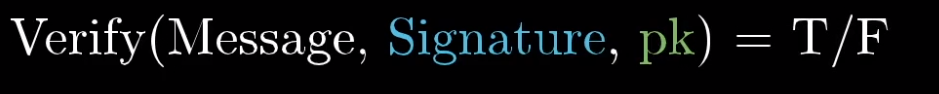

#### Intermediate Evaluation
## From BPMN to Permissioned blockchains: A model-driven approach


Nizar Hmain - 2020


---


# Permissionless blockchain networks

- The problem
- Information gathered about the problem
- read crypto and blockchain papers
- what are some of the potential solutions
- read paper about solutions (hyperledger and quorum) 
- what technologies we considered


---

# The problem

The goal is to explore and concretize the problem of permissioned blockchains. The final objective would be to enhance the already previous research and work done on the ChorChain platform done by our Unicam collegues.

[chorchain paper link](http://pros.unicam.it/chorchain/)

---


# The chorchain project

Would essentially take a BPMN Choreographies and scaffold and runnable environment and spawn smart contracts, assiging roles to the actors.  

It solved the already very complex task of mapping BPMN into a solidity smart contract.

This work would be a parallel enhancement to this work

--- 

# Recap on Fundamentals of blockchains

- The data structure

- The cryptography behind it

- It's Decentralized/Distributed nature

- The consensus


---


---


--- 

# Cryptography in blockchains 

--- 


## How are we supposed to trust 

- There is this concept of global state in blockchains (we call it a ledger)
- The issue is that anyone can add a new line to it
- How do we differentiate between users ? 


---

We must add something that is unique to each entity or user. 

If Alice wants to send a transaction to Bob. We must make sure that it's unfeasable for anyone else to forge this transaction in her name.

This is where the concept of digital signatures comes in.


---

How do we prevent anyone from copying someones signature. We do so by generating a Private key / public Key pair.


---





---


Both bitcoin and Ethereum use ECDSA for Public/private key encryption as their algorithm


Another type of public key cryptography that you may be familiar with is RSA, which utilizes prime number theorem (the security for this relies on the fact that we haven't come up with a way to efficiently, mathematically define the distribution of prime numbers) for computational complexity.

ECDSA, uses a different method for computational complexity called the Discrete Logarithm Problem which relies on the infeasible nature of determining the discrete logarithm of a random point on the defined elliptic curve.

One reason for using ECDSA as opposed to RSA, is that ECDSA has equivalent security to RSA while using smaller key sizes. 256-bit public key's computational complexity in ECDSA translate to roughly same the computational complexity of a 3072-bit public key for RSA.

--- 

Note: ECDSA is a digital signature scheme only used to sign transactions. Ethereum additionaly uses AES encryption for their p2p network, and ECIES for the message exchange within whisper.


*Whisper : Whisper is a part of the Ethereum P2P protocol suite that allows for messaging between users via the same network that the blockchain runs on.*

--- 


## Common loopholes with these concepts


### Forgery defence mechanisms
- PKA cryptography does in fact stop copying transactions. But it doesn't stop someone from copying exactly the same message with it's signature and replicating it.

-  if alice sends bob 20$, and the signature is 001101 
-  if alice sends bob 20$, and the signature is 001101 

We add tx_ids to ensure uniqueness 

- tx=1 if alice sends bob 20$, and the signature is 001101 
- tx=2 if alice sends bob 20$, and the signature is 100001
- so in the message we must add a unique ID, that would change the message payload and therefore change the signature as well.


---


### Overspending
- Verifying a transaction requires you to know all the history of the transactions up to that point. That's how we stop overspending.


---


# Decentralized / Distributed


While a blockchain is inherently distributed (meaning that many parties hold copies of the ledger), it is not inherently decentralized. Whether a blockchain is centralized or decentralized simply refers to the rights of participants on the ledger, and is therefore a question of design.


---


---


The most important difference to remember is that blockchain is just one type of distributed ledger. Although blockchain is a sequence of blocks, distributed ledgers do not require such a chain. Furthermore, distributed ledgers do not need proof of work and offer – theoretically – better scaling options.

Removing the intermediary party from the equation is what makes the concept of distributed ledger technology so appealing. Unlike blockchain, a distributed ledger does not necessarily need to have a data structure in blocks. A distributed ledger is merely a type of database spread across multiple sites, regions, or participants.


--- 


### how do we find other nodes and peers


Bootnode is a lightweight application used for the Node Discovery Protocol. Bootnodes do not sync chain data. Using a UDP-based Kademlia-like RPC protocol, Ethereum will connect and interrogate these bootnodes for the location of potential peers.


### p2p discovery

https://en.wikipedia.org/wiki/Kademlia  

https://github.com/ethereum/devp2p/wiki/Discovery-Overview


--- 

### how does eth guarantees account uniqueness, even with offline

Ethereum addresses are 160 bit hashes, meaning there are 2^160 possible hashes. Per the birthday problem, the chance of a collision rises to 50% when there are about 2^80 accounts created.

To give you an idea of how unlikely that is, if every person on earth spent all their time doing nothing but generating Ethereum accounts, and they generated one a second, they'd only generate about 2^57 of them. To generate 2^80 and reach a 50% probability of finding a collision, they'd need to keep on generating one per second for about 8 million years.

In short, the way Ethereum guarantees account uniqueness is by having such a mindbogglingly large number of possible addresses that no conceivable random process could ever generate a duplicate. This is also how account security is ensured - if you can generate a duplicate key hash, you can also steal someone's ether!

---

# Consensus algorithms


- Mechanisms which a blockchain network reach consensus
- The consensus algorithm used by bitcoin is called Proof Of Work
- The concept of POW is much older than cryptocurrency
- Bitcoin uses a modified version of POW to act as a BFTS
- Consensus protocols are a solution to the double-spend problem (counterfeit bills)

---

### Byzantine fault tolerant
[Byzantine fault tolerant](http://pmg.csail.mit.edu/papers/osdi99.pdf)


- Created in 1982 
- Based on the idea of military communications 
---


---


---


### What is Byzantine fault tolerance ?

*It's the property of a system able to resist the problems and failures derived from the byzantine generals problems*
*A BFTS is a system that continues to work when nodes are malicious or fail to communicate*

- Aviation sector
- Space agencies
- Nuclear power industry

--- 

### Other consensus algorithms

- Proof of Stake (used by ethereum)
- PBFT: (Liskov and Castro Paper 1999)
- Raft: a simpler algorithm, very much inspired by Paxos (used mainly for dev)
- Proof of Elapsed Time
- Tenderming consensus engine (used by Hyperledger burrow)


- Apache Zookeeper uses a version of Paxos called Zookeeper Atomic Broadcast (Big data)
- etcd uses the Raft consensus (used by Kubernetes)


---


### raft consensus algorithm

Raft visualization (alternative to the Paxos family of algorithms)
http://thesecretlivesofdata.com/raft/


---


# hyperledger sawtooth


- Try to spin up a network on 
- Understand the architecture
- Things that aren't suited for our usecase
- Front-end visualization tool

---


---


---


---

Add screenshot of Sawtooth-delve


--- 

# How can BPMN be used here ?


--- 


---


---


--- 

So far so good, we managed to map BPMN logic into code that runs in a distributed fashion on a blockchain.

The next issue is the following. 
- How can this be automated ?
- And How can we limit the visibility of certain actions

---

- There was an attempted at writing a BPMN parser that would later transform that into python code that would be running as a Transaction processor  

- The only problem was that it isn't easy to write a BPMN parser from scratch
- Why not use some already existing work from Chorchain. (It's already capable of transforming BPMN into Solidity smart contracts).
- As engineers, we are not supposed to reinvent the wheel.
- The second issue is still the privacy issue

--- 

## Running smart contracts on Sawtooth 


The primary goal of the Sawtooth-Ethereum integration project, affectionately dubbed "Seth", is to add support for running Ethereum Virtual Machine smart contracts to the Hyperledger Sawtooth platform. In order to make this possible, the Hyperledger Sawtooth project worked with the Hyperledger Burrow project to integrate their EVM implementation, the Burrow EVM, into with the Hyperledger Sawtooth platform.


---


---
So now we can technically run smart contracts on sawtooth, can we have this notion of private data ? 

---


---


---

The only way to limit visbility of a Transactions Processor so far is to use encryption with Public key
- This feature is not available by default on sawtooth so we wrote a script that manages to do that

```
from ecies.utils import generate_key

from ecies import encrypt, decrypt

import binascii

import coincurve

pub = '0227ffac7d33231086df84e12f0856c0e985c18d3daa2c94c7abcbff9a6aa8b258'
priv = 'ee113297d1fb3c214722aadf59a3d94dff24264ffc5c34b78c903b36eb1aeca8'

```
---


```

def enclave_dec(priv, bytes_data):
	coincurve_privk = coincurve.PrivateKey.from_hex(priv)

	sk_hex = coincurve_privk.secret
	pk_hex = coincurve_privk.public_key.format(True)

	decrypted = decrypt(sk_hex, bytes_data) 
	print(decrypted)
	return decrypted


def enclave_enc(pub, bytes_data):
	encrypted = encrypt(pub, bytes_data) 
	print(encrypted)
	return encrypted 


enclave_enc(pub, b'this is data')
enclave_dec(priv, enclave_enc(pub, b'thi is data'))

```
---

However this behavior needs to be added at the architecture-level of the Hyperledger sawtooth. Which means either maintaining our own fork or have a pull request on the main sawtooth repo.


--- 


# Intel sgx

- https://github.com/intel/linux-sgx

- https://sgaxe.com/, Extensive studies showing that it's been hacked several times


- Decentralized solutions shouldn't rely on centralized hardware solutions in my opinion (no transparency)

- meltdow and spectre are possible even for sgx enclaves

---


---

# PDO sawtooth using SGX

- https://github.com/hyperledger-labs/private-data-objects


- PDO performs contract execution and storage off the blockchain, with only a hash of blockchain state stored on the distributed ledger.

- similar to private ledgers in quorum (we'll see this one later)
- follows the Microsoft CCF (confidential consortium framework) https://microsoft.github.io/CCF/master/introduction.html

- This theoretically allows the execution of smart-contracts. The issue is that the language of the SC's is not solidity. 

---

# GIPSY language

## General Intensional Programming System

[gipsy language axis paper](https://arxiv.org/abs/0906.3911#:~:text=The%20General%20Intensional%20Programming%20System%20(GIPSY)%20has%20been%20built%20around,multidimensional%20reasoning%20of%20intensional%20expressions.)

So there are 2 issues with PDO

- It assumes that SGX is a secure technology

- It cannot run solidity contracts

- It requires specific hardware (hardware locking)

- All the contributions come from people working at Intel and it's sponsored by the company 


---


---

 digital identities rooted on blockchains or other distributed ledgers so that they are interoperable across administrative domains, applications, and any other silo.
 
 Indy is interoperable with other blockchains or can be used standalone powering the decentralization of identity.

 Indy has this concept of privacy at the core, that's why I wanted to check what their approach and use case are like.


---


---

This project is not exactly about privacy but there are some ideas that are shared

*It's essentially decentralized private data*


- Distributed ledger purpose-built for decentralized identity
- Correlation-resistant by design
- DIDs (Decentralized Identifiers) that are globally unique and resolvable (via a ledger) without requiring any centralized resolution authority
- Pairwise Identifiers create secure, 1:1 relationships between any two entities
- Zero Knowledge Proofs which prove that some or all of the data in a set of Claims is true without revealing any additional information, including the identity of the Prover

---


---

Based on Ethereum, Quorum is an open source blockchain platform that combines the innovation of the public Ethereum community with enhancements to support enterprise needs.


---


--- 

- We can keep all the web3 tools that work with ethereum
- runs solidity smart contracts
- keeps up with the Eth eco-system
- has a private ledger to limit vibility
- production-ready battletested technology used in the real world

--- 


---


Quorum supports dual state:

Public state: accessible by all nodes within the network
Private state: only accessible by nodes with the correct permissions


---

The difference is made through the use of transactions with encrypted (private) and non-encrypted payloads (public). Nodes can determine if a transaction is private by looking at the v value of the signature. Public transactions have a v value of 27 or 28, private transactions have a value of 37 or 38.


---


---


---
Explain the change of direction of the project
--- 


