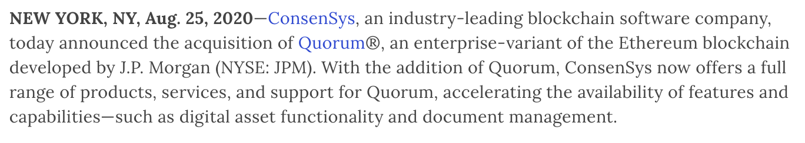
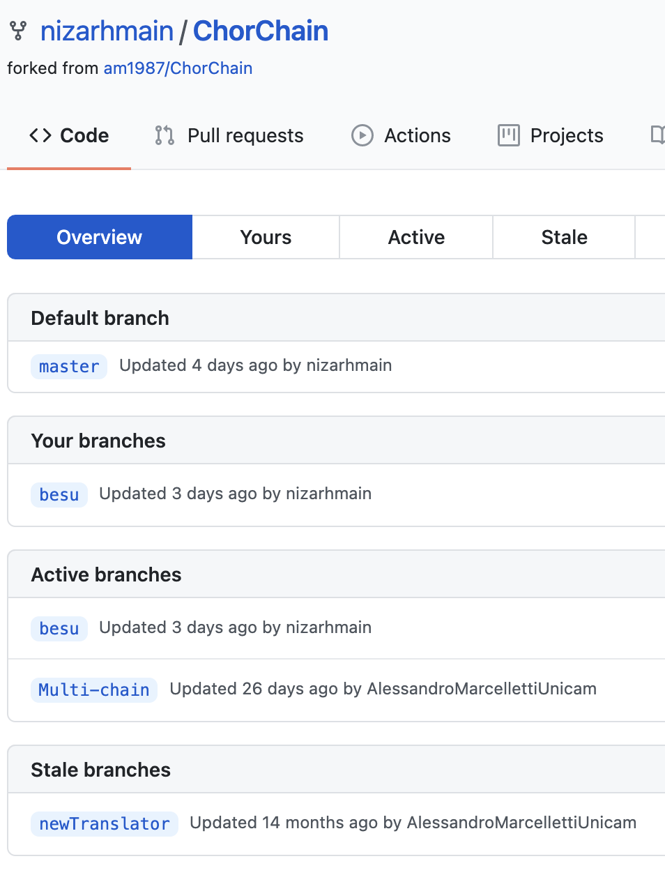
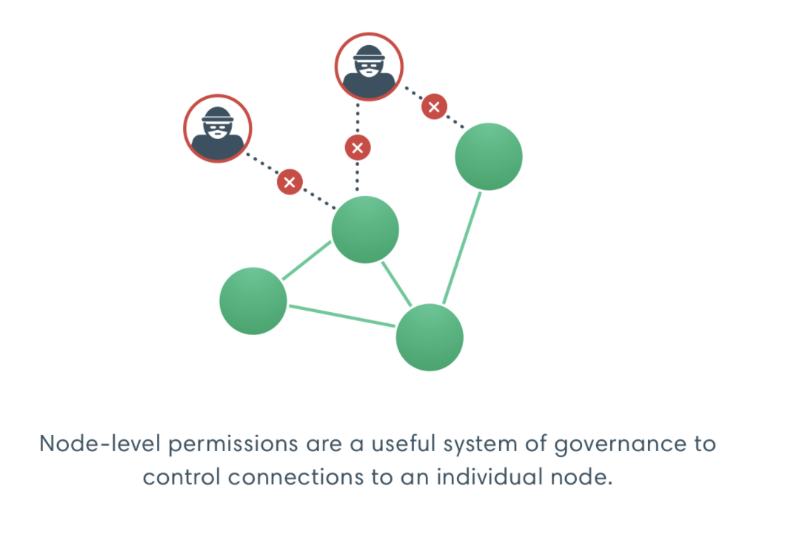
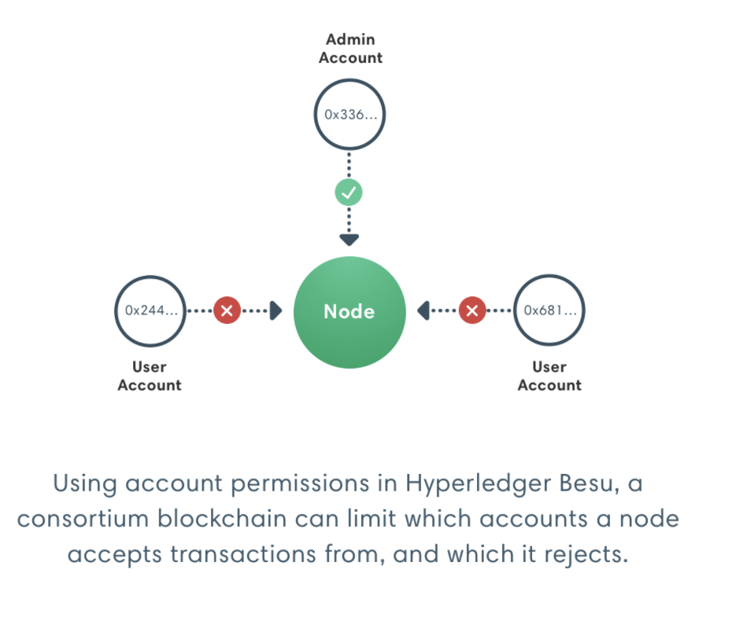
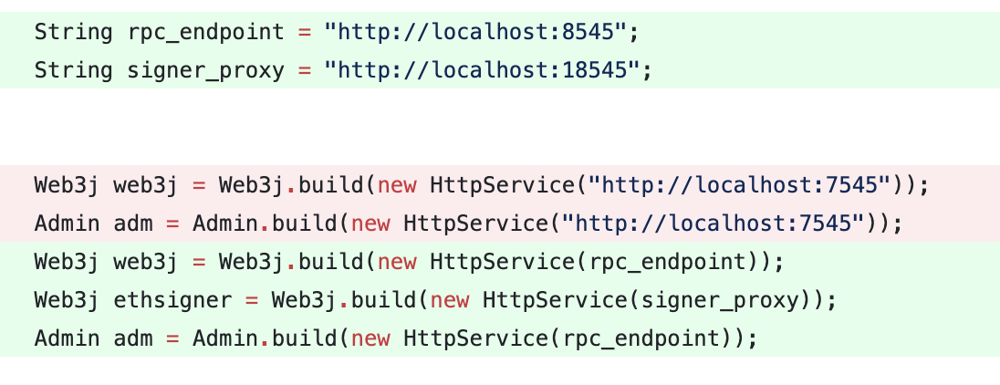
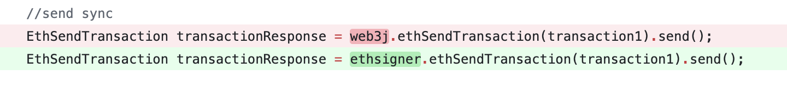
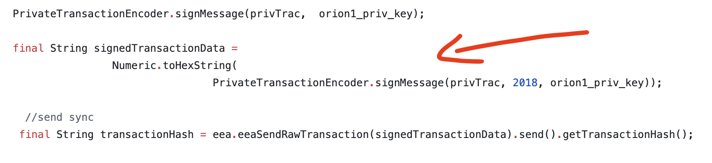

# 22/03/2021 status update

## From BPMN to Permissioned blockchains: A model-driven approach.

Nizar Hmain

---

---

---

---

---

---

---

---

EthSigner acts as a proxy service by forwarding requests to the Ethereum client. When EthSigner receives a transaction it generates a signature using the stored private key, and forwards the signed transaction to the Ethereum client.

Note: Besu does not implement `eth_sendTransaction()`, we must use `eth_sendRawTransaction` and sign it ourself or instead call `localhost:8545` the default rpc node, we call the ethSigner node that signs it for us `localhost:18545` with `eth_sendTransaction`

---

---

---

---

In order to send private transactions however, we need to use `eea_sendRawTransaction` instead of `eth_sendTransaction` which generates a privacy marker transaction and submits it to the tx pool, and returns the transaction hash of the privacy marker transaction. Essentially storing some information publically and some privately. 

---

here comes the hart part. This method would not throw an exception when called and would just exit.

---

---

The `web3j.eea` package needs v4.8.4
The `web3j.besu` uses as well v4.8.4
The `web3j.org` uses as well v4.8.4

I realized that maybe the signing method in utils was wrong .... or just the wrong version

updated `web3j.utils` `web3j.crypto` from version 4.1.1 to version 4.8.4 and it worked

---

Still need to cleanup and fix the interface to select nodes that would have access to the private smart contract and so on ... 

---

1. Run ChorChain ✅
2. Besu public transactions ✅
3. Besu private transactions ✅ (ni) 
4. GoQuorum public tx ❌
5. GoQuorum private tx ❌
6. Interface and code cleanup ❌

---

