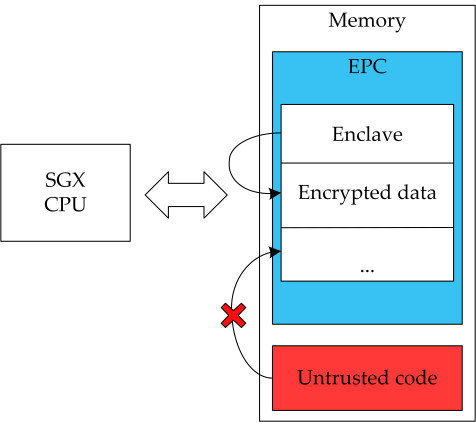
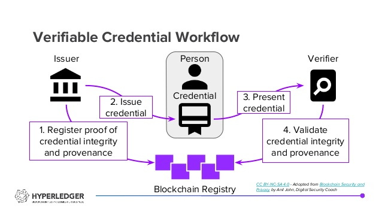

# Private Data in permissioned blockchains

Thesis report and briefing

18/06/2020

UNICAM

Nizar Hmain

---
- Approaches studied 
- Production-ready solution : Quorum (JPMorgan)
- Possible enhancement for Hyperledger: integration of a cryptagraphic enclave for sawtooth

---

---

# UTXO (depecrated in 0.8)

unspent tx output is just the output from a transaction that a user owns and that they are able to spend it later. your total balance in the bitcoin system is the sum of all non-spent transactions.
- 75 dollars. you need a combination of different bills, there is no 75 single bill. Each of those bills are unspent outputs. Those usually come from other transactions themselves. 
- 10 + 20 = 30. the lunch costs 28. you get 2$ is an unspent output. the Unspent tx is basically the "change". 

---

- i wanna send you 3 tokens. i have 2 unspent tokens, and one for 1.5 tokens. i would have to create a tx to send both of tokens. address the remaining extra tokens back to me. im giving myself change. the output of a tx is my unspent output.
- total input = total output, fundamental rule for all cryptos
- on hyperledger sawtooth you used to be able to use those UTXO and validate them against a TEE (trusted execution Environment). 
- Value and details of the UTXO are described by the UtxoDocument held off chain.
- it uses SGX for the security

--- 

- Privacy is achieved through the offloading of the data offchain. And that offloading is enhanced with SGX technology. Smart contract cannot be privatized in this context.

- Once the utxo is spent, the state of the ledger remains visibile and everyone having access to that node, can see that the transaction happened, and see the amount. We're not really achieving limited-visibility private transactions.

--- 

# Intel sgx

- https://github.com/intel/linux-sgx

- https://sgaxe.com/, Extensive studies showing that it's been hacked several times

- Decentralized solutions shouldn't rely on centralized hardware solutions in my opinion (no transparency)

- meltdow and spectre are possible even for sgx enclaves

---

# PDO sawtooth using SGX

- https://github.com/hyperledger-labs/private-data-objects

- PDO performs contract execution and storage off the blockchain, with only a hash of blockchain state stored on the distributed ledger.

- similar to private ledgers in quorum (we'll see this one later)
- follows the Microsoft CCF (confidential consortium framework) https://microsoft.github.io/CCF/master/introduction.html

- This theoretically allows the execution of smart-contracts. The issue is that the language of the SC's is not solidity. 

---

# GIPSY language

## General Intensional Programming System

[gipsy language axis paper](https://arxiv.org/abs/0906.3911#:~:text=The%20General%20Intensional%20Programming%20System%20(GIPSY)%20has%20been%20built%20around,multidimensional%20reasoning%20of%20intensional%20expressions.)

So there are 2 issues with PDO

- It assumes that SGX is a secure technology

- It cannot run solidity contracts

- It requires specific hardware (hardware locking)

- All the contributions come from people working at Intel and it's sponsored by the company 

---

# Hyperledger fabric channels 

 Conceptually, the overall deployment of a particular Hyperledger Fabric network is like one giant channel (i.e. to broadcast data to everyone) whereas private communications consist of subsets of this overall network. Each subset, called a channel, is like a miniature blockchain network.

---

*"In order to move to full production, more than 100,000 channels would need to be established and maintained, covering all existing Nostro relationships, presenting significant operational challenges.”* — Finextra (2018), Adoption of Hyperledger presents significant operational challenges for Swift member banks.

 

*“As we looked at the different scalability pieces of Hyperledger, we saw that it could get challenging, at least at the current throughput of Fabric. So we started doing some testing on Corda and realized, at least in this specific case, it made a lot of sense.”* Jesse Chanard, MonetaGo CEO (2019),

---

---

---

 digital identities rooted on blockchains or other distributed ledgers so that they are interoperable across administrative domains, applications, and any other silo.
 
 Indy is interoperable with other blockchains or can be used standalone powering the decentralization of identity.

 Indy has this concept of privacy at the core, that's why I wanted to check what their approach and use case are like.

---

---

This project is not exactly about privacy but there are some ideas that are shared

*It's essentially decentralized private data*

- Distributed ledger purpose-built for decentralized identity
- Correlation-resistant by design
- DIDs (Decentralized Identifiers) that are globally unique and resolvable (via a ledger) without requiring any centralized resolution authority
- Pairwise Identifiers create secure, 1:1 relationships between any two entities
- Zero Knowledge Proofs which prove that some or all of the data in a set of Claims is true without revealing any additional information, including the identity of the Prover

---

---

Based on Ethereum, Quorum is an open source blockchain platform that combines the innovation of the public Ethereum community with enhancements to support enterprise needs.

---

--- 

- We can keep all the web3 tools that work with ethereum
- runs solidity smart contracts
- keeps up with the Eth eco-system
- has a private ledger to limit vibility
- production-ready battletested technology used in the real world

--- 

---

Quorum supports dual state:

Public state: accessible by all nodes within the network
Private state: only accessible by nodes with the correct permissions

---

The difference is made through the use of transactions with encrypted (private) and non-encrypted payloads (public). Nodes can determine if a transaction is private by looking at the v value of the signature. Public transactions have a v value of 27 or 28, private transactions have a value of 37 or 38.

---

---

---

- The same applies for limited-visibility of smart contracts (show demo, scripts )

- The goal would be now to try to mimic and extend this behavior to a hyperledger sawtooth network

---

### demos

- show public key encryption script using coincurve

- show web3 python script written that interacts with quorum net

- show private transactions and smart contract with quorum net
