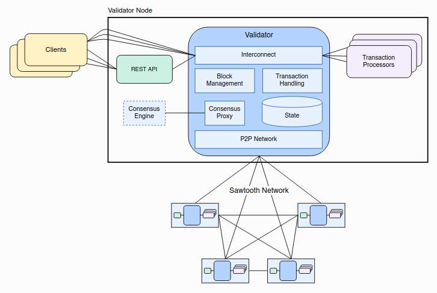
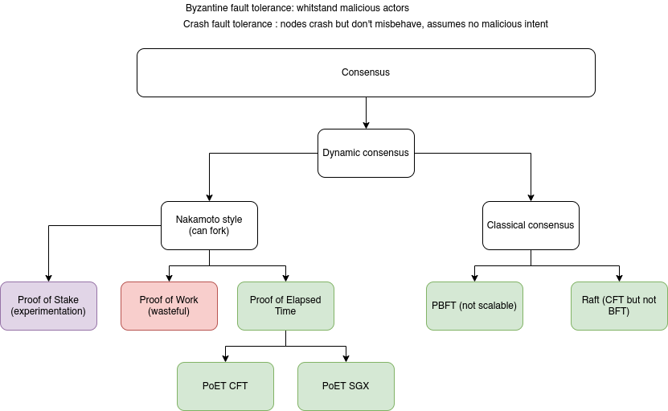

## Brainstorming report 


--- 





--- 

# Clients:

write your own approach.
favors customization over pre-existing frameworks.

Java, go, python, javascript, rust, java.

https://github.com/hyperledger/sawtooth-explorer

dashboard but not maintained, helps to see clearly the state, transactions of the ledger (built on top of deprecated software)

- note: *Could be some work to do on this side as well. part of the project could potentially involve build a proper frontend to interface with the blockchain*

---

# Rest api

Seems really complete and functional and supports pagination. not much to improve on this side
Offers more or less the same functionality as the cli but wrapped in a REST API. HTTP makes it super accessible for consumption and building things of top of it

```
/transactions: shows all the transactions
/batches: shows all the batches 
/state: shows state information
```
- note: *Not much to improve on this side*


---

# Consensus Engine

Lots of potential theoretical work and analysis to be done on this one.



---

# Transactions

*Each application defines the custom transaction processors for its unique requirements. Sawtooth provides several example transaction families to serve as models for low-level functions (such as maintaining chain-wide settings and storing on-chain permissions) and for specific applications such as performance analysis and storing block information.*


Businesses that are in the same consortium would benefit from having a tool or an automated procedure to test the transaction processors that are running in the same network


---

Write a tool that could help test this between different orgs in an easy fashion. Maybe using a frontend that would communicate to a backend that would scan the networks and the transaction processors to see if there were any differences between the business agreements and the actual code running.

More information is written in the main README. (TPs are kind of like smart contracts but with simpler logic)

Maybe write a framework that would test both, smart contracts and TPs. (investigate in seth)

---


## main differences between fabric and sawtooth

| Fabric        |  Sawtooth          
| ------------- |:-------------:|
| permissioned-only      | permissioned and permissionless |
| fine-grained governance      | roles and permissions more flexible      |


---


---